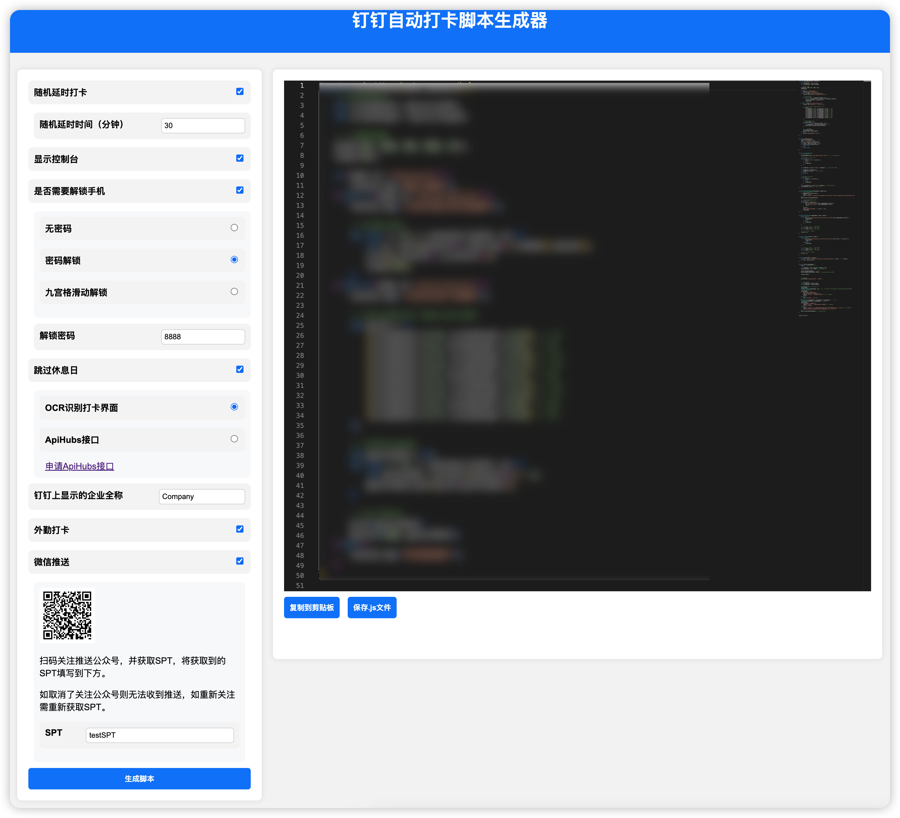

# 偷鸡摸鱼工具包
## 1. 介绍
本工具包集成了部分自动化工具，用于提高工作效率，减少重复劳动。

## 2. 使用说明
### 2.1. 依赖
- Python 3.8+
- Flask
- Flask-Cors
- pystray
- pillow
- PyAutoGUI
- gevent
- jsbeautifier

### 2.2. 使用方法
1. 安装依赖
```pip install -r requirements.txt```
2. 运行
```python main.py```
3. 在系统托盘中找到图标，点击选择需要的功能即可

## 3. 功能
### 3.1. 保持Teams在线
- 功能：自动模拟鼠标移动，每10秒随机移动0~1px，保持屏幕唤醒状态，防止Teams自动离线
- 使用：点击系统托盘图标，选择“保持Teams在线”
- 注意：使用过程中出现鼠标自动偏移1px的情况，是正常现象，不影响使用
- 关闭：点击系统托盘图标，取消选择“保持Teams在线”

### 3.2. Dingtalk自动签到脚本生成器

- 功能：生成钉钉自动签到脚本（AutoX脚本）
- 使用：点击系统托盘图标，选择“钉钉打卡脚本”，自动打开浏览器，按需要生成脚本
- 注意：生成的脚本仅供参考，具体使用请根据实际情况修改
- todo:
- [x] 复制脚本到剪贴板
- [x] 保存到文件
- [x] 屏幕自动解锁
- [x] OCR识别是否打卡成功
- [x] 公众号推送打卡结果
- [x] 防止Flask服务端口被占用，自动分配随机端口
- [ ] 【待解决】当脚本设置了屏幕解锁密码时，且屏幕已解锁，程序会遇到无法找到解锁键盘而进行不下去的情况，需要用户重新锁屏并上划触发解锁键盘才能继续，目前还没有找到比较好的方法判断当前设备是否处于已解锁状态。

### 3.3. 待补充其他功能

## 4. 打包方法
> 本工具包使用pyinstaller可打包成Mac、Windows、Linux可执行文件
1. 安装pyinstaller
```pip install pyinstaller```


2. 打包
  - Mac: ```pyinstaller -w -n CockStealer --noconfirm -i images/app_icon.ico --add-data "images/tray_icon.ico:images" --add-data "flask_app/static:flask_app/static" --add-data "flask_app/templates:flask_app/templates" --osx-bundle-identifier com.hardcore.cockstealer main.py```
  - Windows: ```pyinstaller -w -n CockStealer --noconfirm -i images/app_icon.ico --add-data "images/tray_icon.ico;images" --add-data "flask_app/static;flask_app/static" --add-data "flask_app/templates;flask_app/templates" main.py```

3. 运行
```dist/CockStealer```

> Mac打包的单文件出现Permission Denied情况，暂未解决

## 5. 更新日志
- **v0.5.14**
  - 更新日期：2024-10-26
  - 引入jsbeautifier，优化生成的AutoX脚本
  - 钉钉打卡脚本增加延时打卡功能

- **v0.4.12**
  - 更新日期：2024-10-26
  - 钉钉打卡脚本兼容OCR（使用Google ML kIT OCR模型）
  - 钉钉打卡脚本增加OCR识别当日是否需要上班功能
  - 钉钉打卡脚本增加OCR识别打卡结果功能
  - 钉钉打卡脚本增加多个微信公众号推送场景


- **v0.3.9**
  - 更新日期：2024-10-26
  - 钉钉打卡脚本增加微信公众号推送打卡结果功能(接入wxPusher)
  - 优化代码结构


- **v0.2.7**
  - 更新日期：2024-10-25
  - 完善monaco-editor的JavaScript联想提示
  - 钉钉打卡脚本增加复制脚本功能
  - 钉钉打卡脚本增加保存js文件功能


- **v0.2.4**
  - 更新日期：2024-10-25
  - 钉钉打卡脚本增加解锁屏幕功能：无密码、数字密码、九宫格图案密码
  - 钉钉打卡脚本解决有时无法结束钉钉进程问题


- **v0.2.2**
  - 更新日期：2024-10-24
  - 修复Flask服务端口被占用问题
  - 优化代码结构


- **v0.2.0**
  - 更新日期：2024-10-21
  - Dingtalk自动签到脚本生成器


- **v0.1.0**
  - 更新日期：2024-10-13
  - 保持Teams在线